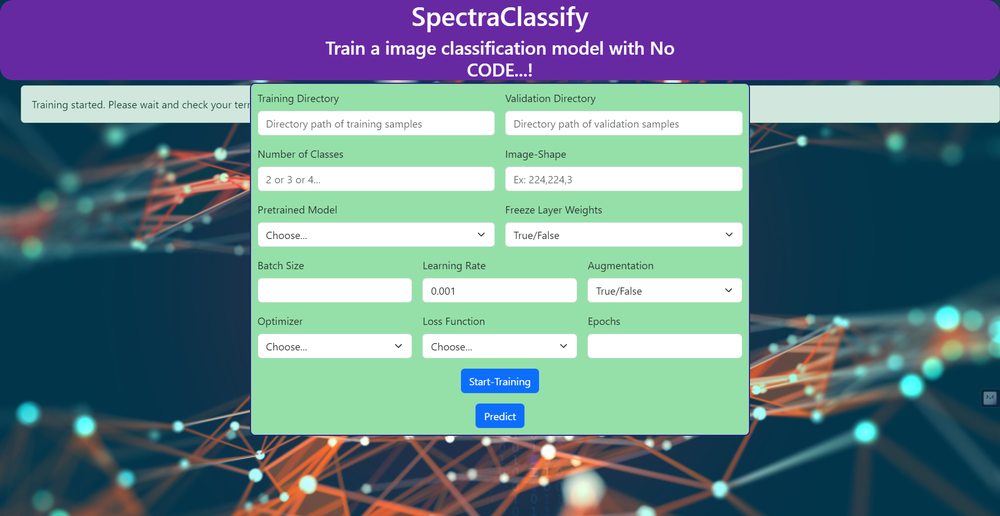

# SpectraClassify
## A python package for zero code image classification within the browser
SpectraClassify is a python package for zero code image classification within the browser. Any can experience the power of deep learning without writing a single line of code and have their trained model.


# SpectraClassify

## Introduction

Welcome to SpectraClassify, a cutting-edge Python package that revolutionizes the world of image classification. This tool brings the formidable capabilities of deep learning to your fingertips, allowing anyone, regardless of their coding background, to harness the power of AI for image classification - all within the comfort of their browser.

## Features

- **Zero-Code Classification**: Experience AI without writing a single line of code.
- **Browser-Based**: Easy access through your favorite web browser.
- **Deep Learning Powered**: Built on robust deep learning frameworks.
- **User-Friendly Interface**: Intuitive and easy to navigate.
- **Custom Model Training**: Train models with your own datasets.
- **Real-Time Results**: Immediate feedback on image classification.

## Getting Started

### Prerequisites

Before you begin, ensure you have the following:
- Python 3.10 or later.
- A modern web browser.

### Installation

To install SpectraClassify, run the following command:

- Create Anaconda environment
```bash
conda create --name spectraclassify python=3.10
```
or
- python virtual enviroment

Windows
```bash
python3.10 -m venv spectraclassify

cd venv\Scripts\activate
```
Linux + macOS
```bash
$ python3.10 -m venv spectraclassify
source venv/bin/activate
```
```bash
pip install SpectraClassify
```

### Launching the Application at local hotst http://127.0.0.1:8080/

After installation, start the application using terminal command:

```bash
run
```

This command will open SpectraClassify in your default web browser.
<br>

<br>
## Usage

1. **Specify Train data path**: Paste the select training image directory path that you want to trained on.
2 **Specify Validation data path**: Paste the validation data path.
3. **Choose Model**: Select from a list of pre-trained models.
4. **Train**: Click 'Start-Training' and keep eyes on terminal to see the training process.
5. **Model evaluation Results**: Check the terminal for model evaluation results after taining.


## Import in your code <;>
- After installing
```bash
pip install SpectraClassify
```
```python
from spectraclassify.training_service import start_training
# takes 2 dictornary as input contains model configuration and data configuration
start_training(
    model_conifg=model_configurations,
    data_config=data_configurations)

```

```python
data_configurations={
        'TRAINING_DIR': training_dir, # training dataset directory
        'VALIDATION_DIR': validation_dir, # validation dataset directory
        'CLASSES': classes, # intiger valud of number of classes
        'IMG_SIZE': (h, w, channels), # tupple of imaze shape
        'BATCH_SIZE': int(batch_size), # intiger
        'AUGMENTATION': bool(augmentation) # boolian
    }

model_configurations= {
        'MODEL_NAME': model_name, # string
        'FREEZE_LAYER': freeze_layer, # boolian
        'EPOCHS': int(epochs), # intiger
        'LEARNING_RATE': float(learning_rate), # float
        'OPTIMIZER': optimizer, # string value of  optimizer funciotn name
        'LOSS': loss # string value of loss function name
    }

```

## Contributing

We welcome contributions! If you would like to contribute, please follow these steps:
- Fork the repository.
- Create a new branch for your feature.
- Commit your changes.
- Push to the branch.
- Submit a pull request.

## To-Do
- Design and implement prediction pipeline
  + Image upload and prediction
- Realtime-webcam inferancing
- Creating dataset (train and val)
- Custome layer building option


## License

SpectraClassify is released under the [MIT License](LICENSE).

## Support

For support, questions, or feedback, please raise an issue in the GitHub repository.

---

Happy 🙌🏼 custome image Classifying with SpectraClassify!

*This README provides a comprehensive guide to help users understand, install, and use SpectraClassify package.*